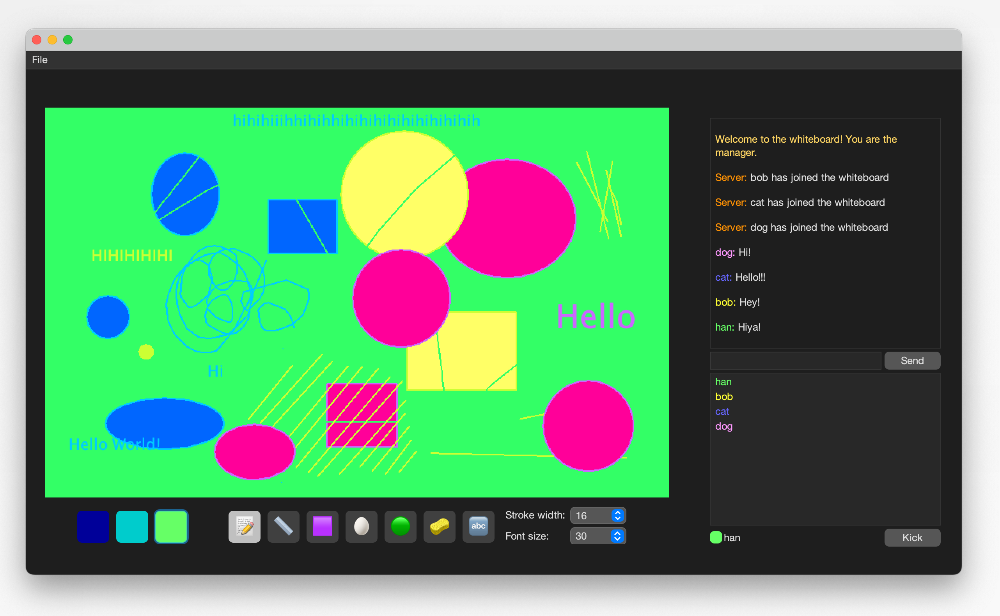

# Distributed Whiteboard System

## Introduction
This project is a Distributed Whiteboard System implemented in Java using Remote Method Invocation (RMI). The system allows multiple client users to connect to a central manager's whiteboard server, where they can draw, create shapes, and type text that is visible to all connected users. Also, a chat feature enables communication among users, and a user list displays all connected participants, including the manager.

The manager has special privileges to control the whiteboard and manage user access.

## Features
- **Real-time collaborative whiteboard** where users can draw, create shapes, and type text.
- **Remote Method Invocation (RMI) architecture** to facilitate communication between clients and the server.
- **Multi-user support**, allowing multiple clients to connect and interact with the whiteboard.
- **Chat functionality** for communication between users.
- **User management** by the manager, who can accept or reject users and control permissions.
- **Graphical User Interface** that includes emoji-decorated buttons, drop-down selection, and colour-pickers.

## Implementation
- **Programming Language**: Java
- **Technology Used**: Java RMI (Remote Method Invocation)
- **Architecture**: Client-Server model with a manager controlling the whiteboard
- **Communication**: RMI is used to synchronize user actions and manage the distributed environment. Callback objects and remote whiteboard proxies allow fast transmission of whiteboard actions.

